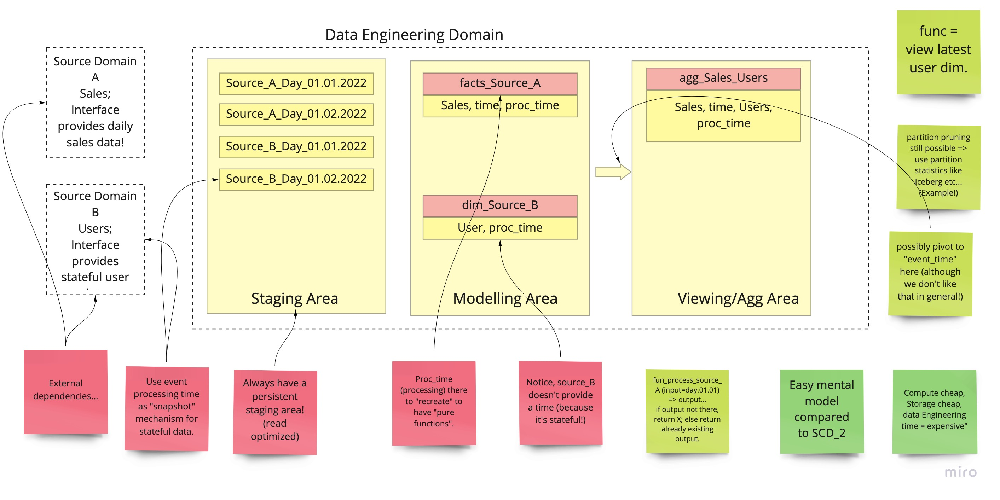

# easy-functional-data-engineering
A cool simple example of functional data engineering



## What is functional data engineering?
It's the ideas of functional data engineering transferred to data engineering
with the goal of getting easy to maintain & easy to reproducible data result.

For the rest I can only refer to Maxime Beauchemin:
- [Functional Data Engineering](https://maximebeauchemin.medium.com/functional-data-engineering-a-modern-paradigm-for-batch-data-processing-2327ec32c42a)
- [A talk by Max on the topic](https://www.youtube.com/watch?v=4Spo2QRTz1k)
- [Another talk by Max on FDE](https://www.youtube.com/watch?v=shW8iQedAXA)
- Finally this video for a deeper look into [functional data engineering & Python] 
(https://speakerdeck.com/ongchinhwee/designing-functional-data-pipelines-for-reproducibility-and-maintainability?slide=76)

## What we got here?
The repository contains two examples of functional data engineering written 
in (very poor!) Python. The idea is to show you the simplest implementations
of these practices without any distraction or fuss. 

- [Example 1 - making a Python load transform extract functional](example_1/Example_1.ipynb)
- [Example 2 - Encapsulating changing logic into data in Python](example_2/Example_2.ipynb)
- [Example 4 - Full functional mini datawarehouse](example_3/Example_4.ipynb)


## How to run in my own machine
If you want to run this on your own machine, you can use *batect*.

Simply run ```./batect dev``` and it will start the notebook server 
for you, mounting everything into it.
