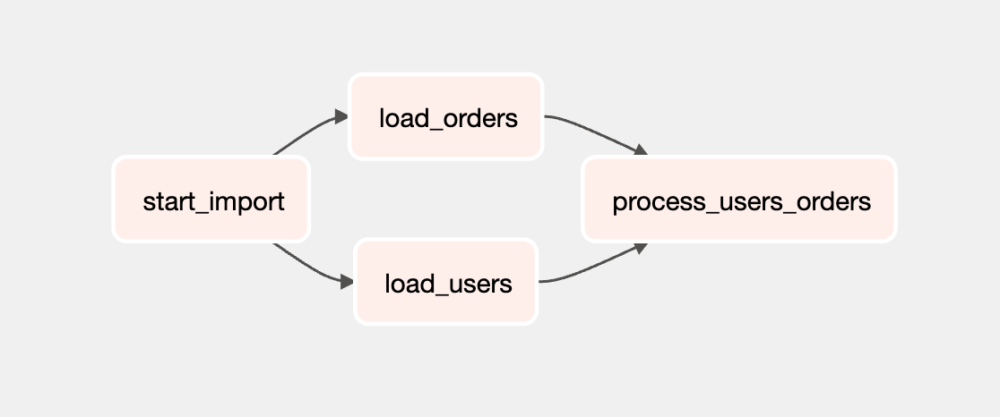
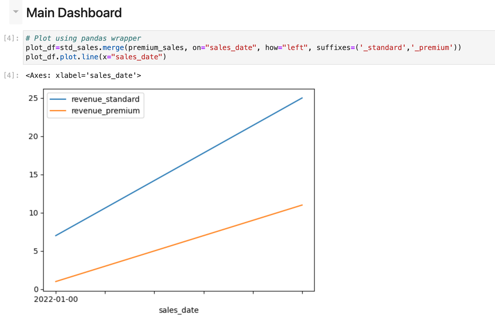
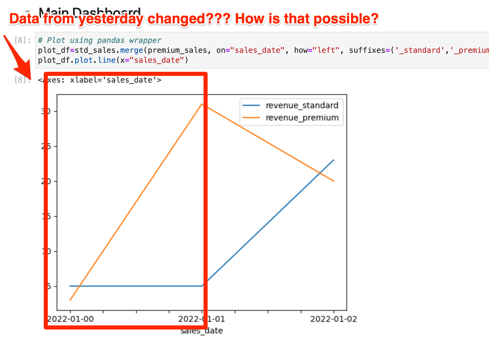
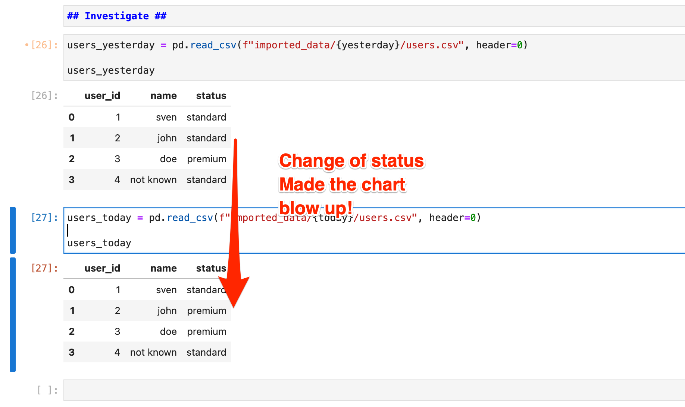
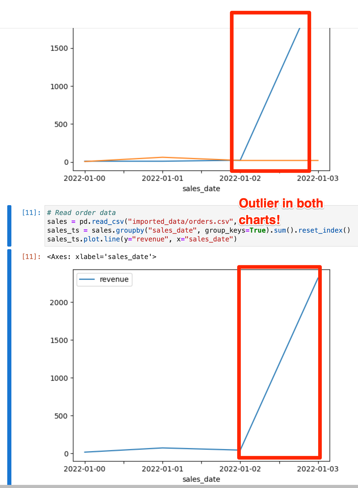

*Like this? =====> **Star it & share it!** And check out [Three Data Point Thursday - the newsletter for this kind of stuff](https://thdpth.substack.com/).*
# Functional Data Engineering with Python/Airflow Tutorial #
Experience the benefits of functional data engineering first hand in a simple Airflow & Python based Setup.
Convert a regular data pipeline to a functional one in two simple steps.

## What's in it
- Super simple setup (Devcontainer, Codespaces)
- Solve "reproducibility of a dashboard" via functional data engineering.
- Solve "immutability of incrementally loaded data" via functional data engineering.
- Get excited about the benefits of functional data engineering.

## Let's get started

0. Open up a new codespace.


Once inside codespaces: 

1. Run ```./go``` to get started. (This takes a second. Copy out the Jupyter token once you see it.)

*If it doesn't work: Look inside the "go" file. If you don't want to work within the browser, feel free to clone and use ./go anyways.
In that case, you'll need docker.* 

---

## (1) Inspect & run the DAG
0. Open up a second terminal. Run ``` ./day-1 ``` to start our working day. Open up Airflow at port 8080 (user airflow; pwd airflow)
1. Take a look at the dag "user_data_dag" inside [users_orders.py](example_6/dags/load_data/users_orders.py). It imports orders & users from the sources. 



2. Trigger a DAG run (it should succeed), and then open up Jupyter at port 8888 (you get the token in the docker-compose start).
3. Open up the work/order_status_chart.ipynb notebook, refresh everything, and take a look at the dashboard. Sales in both segments are growing slightly.



---

## (2) User import goes wrong
Everything is looking good right? Let us progress to the next day then.

1. Run ```./day-2```, then trigger the DAG again.
2. Then refresh the dashboard. You get a new data point for the line chart, but also something strange happens. Data from yesterday will change.



How is that possible? The order import just appends orders, so it cannot "change data from yesterday". Take a look for yourself, there is an "orders" chart inside the same notebook. So the problem must be in the user data.

3. Take a look into the code for the user import. [users_orders.py](dags/load_data/users_orders.py):
```python
def load_users():
    user_data = pd.read_csv(F"/opt/airflow/raw_data/users_{today}.csv")
    user_data.head()
    user_data.fillna({
        'name': 'not known', 
        'status': 'standard'
    }, inplace=True)
    user_data.to_csv("/opt/airflow/imported_data/users.csv", index=False)

```
The third command does some cleaning, and the final command saves the new user state, overwriting the old state. 

**Problem:** This is common practice. The user "source" doesn't provide any kind of dates, and we do need the current state of users to do analytical work. So we get the current state, and overwrite our data. But that means we won't be able to look back at yesterdays data.

**Solution:** So let us implement functional data engineering here to get reproducibility of yesterdays results while still keeping the current state for analysis. We do this by making our data import immutable, by always writing to a new "time partition".

---

## (3) Making users immutable ##

1. Turn time back to yesterday by running ```./day-1```
2. Adapt the DAG [users_orders.py](dags/load_data/users_orders.py) to save user data each day to a new file. Use the path ```/imported_data/users/{today}/users.csv```.  Use the supplied helper variable ```today``` to make this happen.

```python 
    user_data = pd.read_csv(F"/opt/airflow/raw_data/users_{today}.csv")
    user_data.head()
    user_data.fillna({
        'name': 'not known', 
        'status': 'standard'
    }, inplace=True)

    #mkdir if not exist
    import os  
    os.makedirs(f"/opt/airflow/imported_data/{today}/", exist_ok=True)  

    user_data.to_csv(f"/opt/airflow/imported_data/{today}/users.csv", index=False)

```
We're creating the directory if it doesn't yet exist, and use the ```today``` variable to get todays date, and then place todays user state into this directory.


3. Our DAG doesn't end at the import however. So you also need to add the timestamp to the next part of the dag, the task ```process_user_orders```:

```python
def process_users_orders():
    user_data = pd.read_csv(f"/opt/airflow/imported_data/{today}/users.csv")
    order_data = pd.read_csv("/opt/airflow/imported_data/orders.csv")

    result = order_data.merge(user_data, on="user_id", how="left") #

    #mkdir if not exist
    import os  
    os.makedirs(f"/opt/airflow/processed_data/{today}/", exist_ok=True)  

    result.groupby(["sales_date","status"]).sum().reset_index().to_csv(f"/opt/airflow/processed_data/{today}/agg_sales.csv")

```
We're using the same logic here. Use the date of today, create the directory if it doesn't exist yet and then store the results  into a new directory.


4. Now run our new DAG, then run ```./day-2``` to travel forth in time, and run the DAG again. Take a look at the [imported_data](/imported_data) folder to make sure you now got nicely time partitioned data.

4. Next adapt the dashboard to use todays state.

```python 
sales = pd.read_csv(f"processed_data/{today}/agg_sales.csv", header=0)
``` 

5. Now refresh your dashboard, just to be sure that it works. 

6. Still the same problem right? Yes! But now you can travel back in time. Just replace the one variable to "yesterday":

```python
yesterday="day-1"

sales = pd.read_csv(f"processed_data/{yesterday}/agg_sales.csv", header=0)
```

7. Now you can go on to investigate the problem, just load both user data sets and compare them to figure out the problem.



**Outcome 1:** The dashboard still looks the same. But you are now able to investigate the problem by viewing the data version from yesterday.

**Outcome 2:** You can now investigate inside the notebook (display today and yesterday, and then the same for the user data.).

**Insight:** The immutable staged user data allows you to reproduce any state of data. It reveals, in this case, that the dashboard isn't showing 
"order volume by status" but rather "order volume attributed to current status". What probably is more appropriate is "order volume attributed
to status at the time of order".

---

## (4) Let's look at the orders now ##

1. Run ```./day-3``` to get to day 3. Trigger the DAG again.

2. Look at the dashboard again. The result looks odd on both charts this time! There obviously is some kind of fake/test order inside the system. Puh I wish there was an easy way, just like for the user data, to roll back everything to yesterday, right?



3. Take a look into the order import:
```python
def load_orders():
    # import new orders
    order_data = pd.read_csv(f"/opt/airflow/raw_data/orders_{today}.csv")

    # join to old order data
    already_imported_order_data = pd.read_csv("/opt/airflow/imported_data/orders.csv")

    result = pd.concat([already_imported_order_data, order_data], ignore_index=True)
    
    # safe result as csv
    result.to_csv("/opt/airflow/imported_data/orders.csv", index=False)
```

This is pretty standard, import new orders, append to old orders, save result. 

**Problem:** This is common practice. The order data is assumed to be immutable, so we simply append new ones. Out of the box this means, we still don't have "yesterdays state of the data" as we now do for the users.

**Solution:** So let us implement functional data engineering here to get reproducibility of yesterdays results while still keeping the current state for analysis and the incremental load that is commonly used for such immutable data.

---

## (5) Make the order import reproducible ##

1. Travel back in time to day 1 by calling

```./day-1```

2. Adapt the task ```load_orders``` to put each order import into a separate timestamped folder:
```imported_orders/{today}/orders.csv```

```python
def load_orders():
    # import new orders
    order_data = pd.read_csv(f"/opt/airflow/raw_data/orders_{today}.csv")

    import os  
    # safe import 
    # mkdir if not exist
    os.makedirs(f"/opt/airflow/imported_data/{today}/", exist_ok=True)  
    order_data.to_csv(f"/opt/airflow/imported_data/{today}/orders.csv", index=False)

    # join to old order data to create a complete "view"
    already_imported_order_data = pd.read_csv("/opt/airflow/processed_data/orders.csv")

    result = pd.concat([already_imported_order_data, order_data], ignore_index=True)
    
    # safe result as view and as timestamped view (in real life, just make your VIEW walk through the dirs.)
    result.to_csv(f"/opt/airflow/processed_data/orders.csv", index=False)
    
    os.makedirs(f"/opt/airflow/processed_data/{today}/", exist_ok=True)  
    result.to_csv(f"/opt/airflow/processed_data/{today}/orders.csv", index=False)
```

Second, use any Python magic to create a "view" of the current status quo and store it timestamped as well. 

Third, adapt the aggregation task
```python
def process_users_orders():
    user_data = pd.read_csv(f"/opt/airflow/imported_data/{today}/users.csv")
    order_data = pd.read_csv(f"/opt/airflow/processed_data/{today}/orders.csv") #<= this line is changed
```


3. Now run the DAG, travel to day-2, DAG, travel to day-3, DAG.

4. Take a look at the [imported_data](/imported_data) folder to make sure you now got nicely time partitioned data for orders as well this time.

5. Adapt the dashboard chart for the orders to take the time partitioned data.

```python
# Read order data
sales = pd.read_csv(f"processed_data/{today}/orders.csv", header=0)
sales_ts = sales.groupby("sales_date", group_keys=True).sum().reset_index()
sales_ts.plot.line(y="revenue", x="sales_date")

```


6. Finally, roll back your data to yesterday, until the problematic data is fixed, by simply overwriting the deployed time partition. Do so by putting
"day-2" into the file [current_day.txt](raw_data/current_day.txt). Reload the dashboard, and enjoy!

**Outcome 1:** The dashboard is fine. And that with a simple change of a file.

**Outcome 2:** You can now investigate inside the notebook (display today and yesterday, and then the same for the user data.), for every single data no matter in what processing stage.

**Insight:** The immutable staged order data allows you to reproduce any state of data fast! You just need to change a simple line that stores the deployed "view" and that's it.

---

*If you're still just reading this, I strongly recommend to try it out. I've made an effort to make this as accesible as possible, so go for it!*

---


### Reserved for the next tutorial

1. Handle late arriving facts (hello updated order/ order status)
2. Keeping logic inside of data (hello tax rates)
